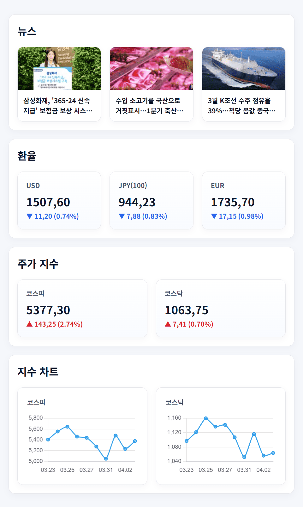

# External Data (API + Crawling)

 

Spring Boot에서 외부 API와 크롤링을 활용해

뉴스, 환율, 주가 데이터를 조회하는 프로젝트입니다.

 

> 관련 내용은 [블로그 글](https://velog.io/@kimkaaa/Spring-Boot-%EC%99%B8%EB%B6%80-API%EC%99%80-%ED%81%AC%EB%A1%A4%EB%A7%81%EC%9C%BC%EB%A1%9C-%EB%8D%B0%EC%9D%B4%ED%84%B0-%EA%B0%80%EC%A0%B8%EC%98%A4%EA%B8%B0)에서 확인할 수 있습니다.

 

## 실행 화면

 

## 주요 기능

- 뉴스 크롤링 (네이버 경제 뉴스)
- 환율 조회 (한국수출입은행 API)
- 주가 지수 조회 (금융위원회 API)
- 전일 대비 증감 및 변화율 계산
- 차트 출력

 

## 구현 방식

### 1) 외부 API 호출

- `RestClient`를 사용해 HTTP 요청
- `uriBuilder`를 활용해 요청 URL 구성
- 연결 시간과 응답 대기 시간을 설정해 과도한 대기 방지

### 2) 크롤링

- Jsoup을 사용해 HTML 파싱
- selector 기반으로 제목, 링크, 이미지 추출
- 상대 경로 링크를 절대 경로로 변환

### 3) 데이터 가공

- 문자열 형태의 숫자를 `BigDecimal`로 변환
- 환율 / 주가 데이터에서 전일 대비 증감 및 변화율 계산

### 4) 영업일 처리

- 최근 영업일 기준으로 조회

 

## 기술 스택

- Java 17
- Spring Boot 3.5.13
- Thymeleaf
- Jsoup
- Chart.js
